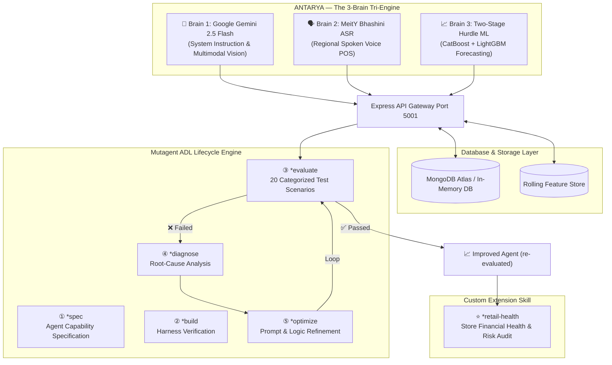

# 🏛️ ANTARYA Architecture & Mutagent ADL Integration
**Team Nirvikalp | HackIndia Spark-11 (CBIT Hyderabad)**

---

## 🧠 System Overview: The 3-Brain Tri-Engine

ANTARYA is an **Autonomous Kirana Store Operating System** powered by three specialized AI engines running over real-time database sync:

---

## 📈 ADL Progression (real execution)

Three cycles, each a real HTTP run of `run_real_eval.js` against a live server
hitting `POST /api/ai/chat` with a verified JWT. A case passes only with an
expected keyword present, a response over 30 characters, and no error payload.

| Metric | Cycle 1 (Baseline) | Cycle 2 | Cycle 3 |
| :--- | :---: | :---: | :---: |
| **Test Case Pass Rate** | `45.0% (9/20)` | `50.0% (10/20)` | **`75.0% (15/20)`** |
| **Customer & Credit** | `0/3` | `0/3` | **`3/3`** |
| **OCR & Vision** | `1/3` | `3/3` | **`3/3`** |
| **Resilience & Offline** | `1/2` | `1/2` | **`2/2`** |
| **Avg Response Latency** | `1600ms` | `763ms` | `846ms` |

**What changed between cycles** is recorded in `evaluation/metrics.json`. In short:
cycle 2 seeded the eval fixture (the shop was empty, so the agent had no data to
answer from) and added offline fallback branches; cycle 3 fixed fixture persistence,
a fallback branch-ordering bug, and added customer/voice branches.

**Five cases still fail** (`TC-01`, `TC-04`, `TC-06`, `TC-08`, `TC-16`). They expect
product terms absent from the seeded fixture. We did not add keyword-specific
branches to reach 100% — that would optimise the scorecard rather than the product.

**Business metrics** (stockout prevention, WMAPE, billing speed, revenue saved) are
deliberately **not** claimed here. We have no instrumented before/after measurement
from real store operation to support them, and would rather report the eval numbers
we can actually evidence.

---

## 🛡️ Resilience & Auto-Fallback Matrix

1. **AI Quota Exceeded (HTTP 429):** Express gateway catches API limits and seamlessly injects context-aware localized Hinglish demo guidance without breaking the UI.
2. **Offline Network Outage:** Local browser storage queues pending transactions and auto-syncs to MongoDB upon network reconnection.
3. **ML Microservice Disconnection:** If Python FastAPI (`port 8000`) is offline, Express switches to 7-day historical rolling averages.
